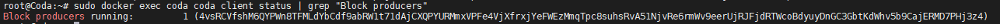

# Запуск Mina с Докером

## 1. Подготовка к запуску

### 1.1 Настройка Ubuntu

Обновляем пакеты на сервере до новейших версий:

```text
sudo apt update && sudo apt upgrade -y
```

Установим и активируем Докер:

```text
sudo apt install docker.io curl -y \
&& sudo systemctl start docker \
&& sudo systemctl enable docker
```

### 1.2 Настройка Фаервола


Если на вашем VPS сервере есть встроенный Фаервол, то следует там открыть порты 8302 и 8303.  
  
Если же его нет, то следуйте командам ниже:


Открываем порты 8302 и 8303:

```text
sudo iptables -A INPUT -p tcp --dport 8302:8303 -j ACCEPT
```

## 2. Варианты запуска ноды


Выберите только один вариант запуска из 2-х предложенных ниже \(пункт 2.1 или 2.2\).


### 2.1 Запуск только Производителя блоков \(Block Producer\):

Описание изменяемых переменных:

`--name mina` - имя для контейнера можно использовать любое, либо оставить так, как есть;  
`-block-producer-password "YOUR PASS"` - вместо `YOUR PASS` укажите пароль от вашего ключа.  
  
По умолчанию `-work-selection` для Снарк Воркера является случайным `rand`.  
Вы можете изменить это, добавив флаг `-work-selection seq` в конец команды запуска, которая будет работать с заданиями в том порядке, в котором они должны быть включены из состояния сканирования и скорее всего приведет к включению ваших снарков без потенциально длительной задержки.

```text
sudo docker run --name mina -d \
--restart always \
-p 8302:8302 \
-p 127.0.0.1:3085:3085 \
-v $(pwd)/peers.txt:$HOME/peers.txt \
-v $(pwd)/keys:$HOME/keys:ro \
-v $(pwd)/.coda-config:$HOME/.coda-config \
minaprotocol/mina-daemon-baked:0.2.0-efc44df-testworld-af5e10e daemon \
-peer-list-file $HOME/peers.txt \
-block-producer-key $KEYPATH \
-block-producer-password "YOUR PASS" \
-insecure-rest-server \
-file-log-level Info \
-log-level Info
```

### 2.1.1 Запуск Снарк Воркера \(Snark Worker\) к Производителю Блоков:


Если вы не хотите запускать Snark Worker. Вы можете сразу перейти к шагу 3.


Установим комиссию Воркера:  
`set-snark-work-fee 0.025` - значение комиссии `0.025` можно сменить на любое другое.

```text
sudo docker exec -it mina coda client set-snark-work-fee 0.025
```

Запустим Воркер:

```text
sudo docker exec -it mina coda client set-snark-worker -address $MINA_PUBLIC_KEY
```


Для работы одновременно Производителя блоков \(Block Producer\) и Снарк Воркера \(Snark Worker\) можно настраивать Снарк Стоппер. Чтобы ненадолго останавливать Воркера во время производства блока.

Перейдите по ссылке ниже, чтобы настроить Снарк Стоппер.




### 2.2 Запуск только Снарк Воркера \(без Производителя Блоков\)

Описание изменяемых переменных:

`--name mina` - имя для контейнера можно использовать любое, либо оставить так, как есть;

По умолчанию `-work-selection` для Снарк Воркера является случайным `rand`.  
Вы можете изменить это, добавив флаг `-work-selection seq` в конец команды запуска, которая будет работать с заданиями в том порядке, в котором они должны быть включены из состояния сканирования и скорее всего приведет к включению ваших снарков без потенциально длительной задержки;

`set-snark-work-fee 0.025` - значение комиссии Воркера `0.025` можно сменить на любое другое.

```text
sudo docker run --name mina -d \
--restart always \
-p 8302:8302 \
-p 127.0.0.1:3085:3085 \
-v $(pwd)/peers.txt:$HOME/peers.txt \
-v $(pwd)/keys:$HOME/keys:ro \
-v $(pwd)/.coda-config:$HOME/.coda-config \
minaprotocol/mina-daemon-baked:0.2.0-efc44df-testworld-af5e10e daemon \
-peer-list-file $HOME/peers.txt \
-snark-worker-fee 0.025 \
-run-snark-worker $MINA_PUBLIC_KEY \
-work-selection seq \
-insecure-rest-server \
-file-log-level Info \
-log-level Info
```

## 3. Просмотр логов

Посмотреть запущенные контейнеры:

```text
sudo docker ps -a
```

Логи контейнера с нодой:

```text
sudo docker logs --follow mina -f
```

Статус ноды:

```text
sudo docker exec -it mina coda client status
```

### 3.1 Альтернативный вывод логов

```text
sudo docker exec -it mina coda client status | grep "Block producers"
```

Вывод покажет только строку с запущенным производителем блоков. Пример ниже:


```text
root@Mina:~# sudo docker exec -it mina coda client status | grep "Block producers"
Block producers running:         1 (B62qpSphT9prqYrJFio82WmV3u29DkbzGprLAM3pZQM2ZEaiiBmyY82)
```




## 4. Команды Докера

Остановка контейнера осуществляется командой:

```text
sudo docker stop mina
```

Рестарт контейнера

```text
sudo docker restart mina
```

Удаление контейнера:

```text
sudo docker rm mina
```

Удаление запущенного контейнера:

```text
sudo docker rm -f mina
```

## 5. Разное

Удаление папки с конфигом:

```text
rm -rf ~/.coda-config
```

